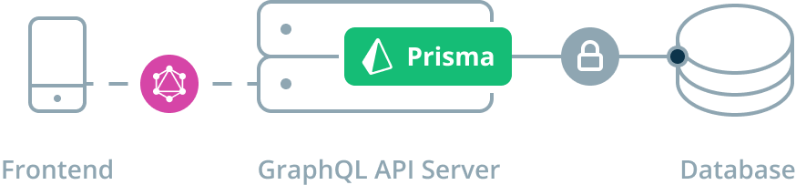
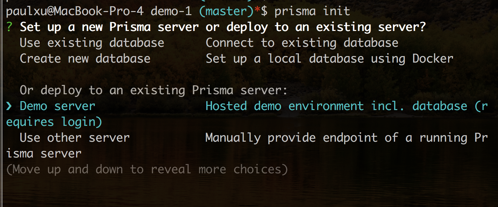
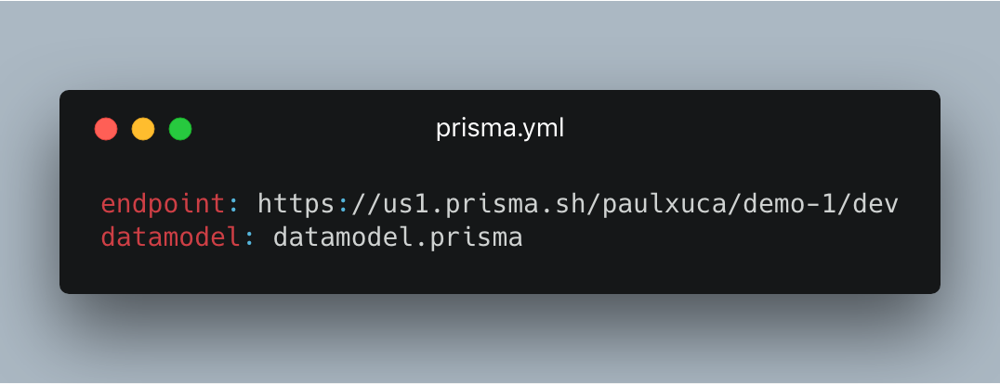
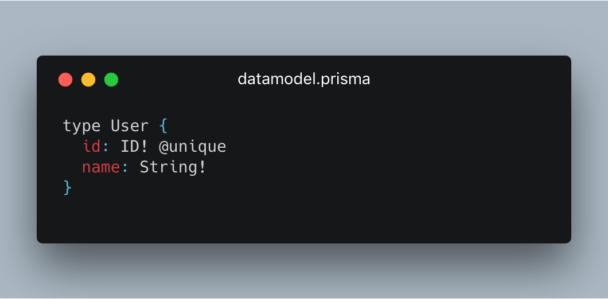
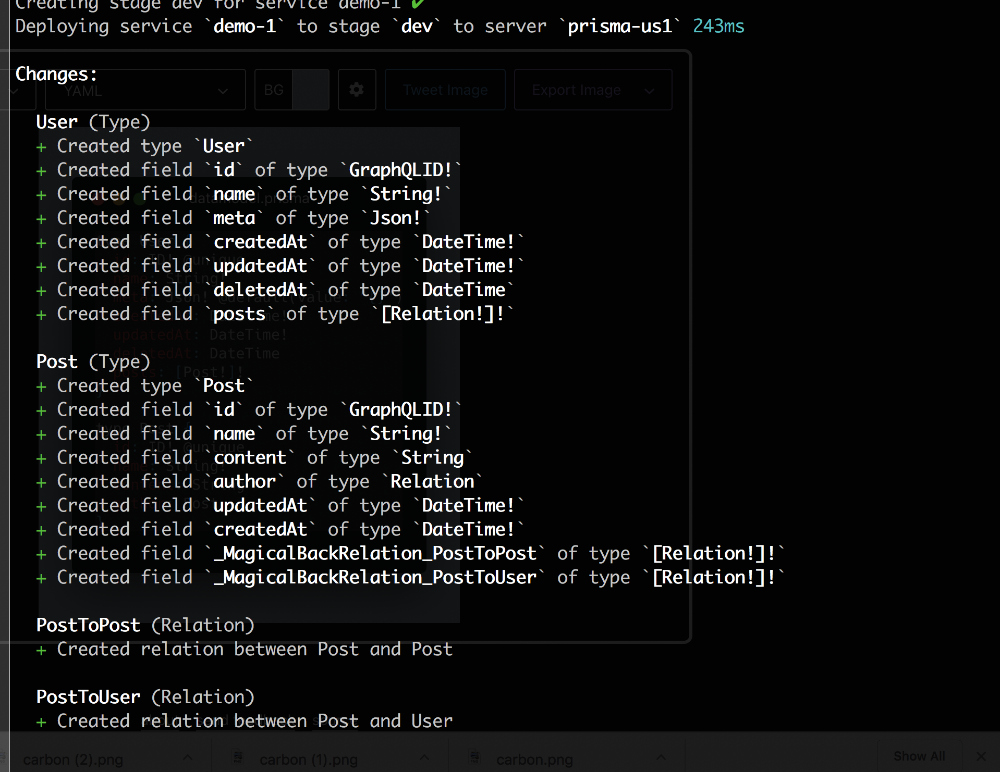
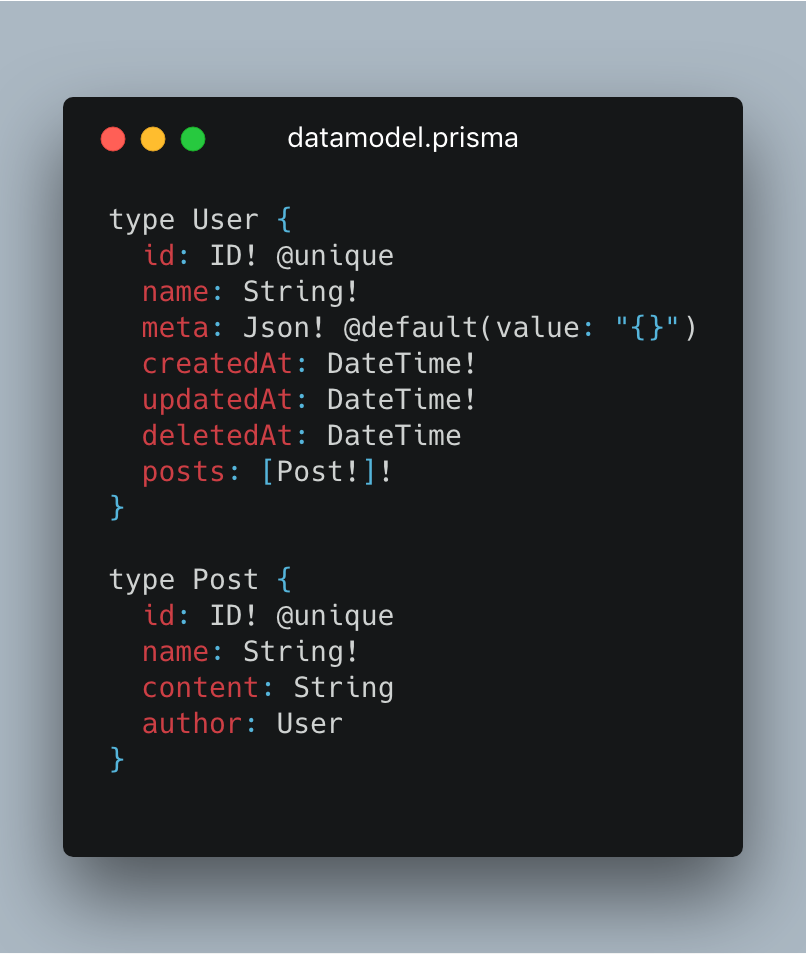
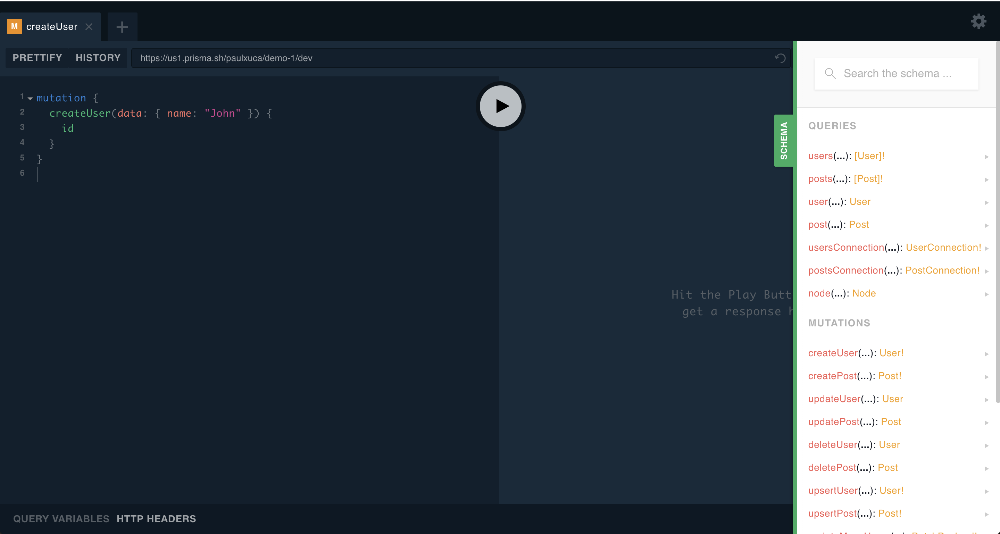
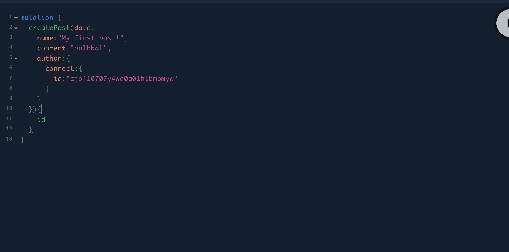

import { Code, Appear, Image } from "mdx-deck";
export { default as theme } from "./theme";


## Prototyping + learning with Prisma

### And Prisma Cloud!

```notes
Thanks to Shopify for hosting, GraphQL Toronto for faciliating

AKA "From 0 to GraphQL in the least amount of time possible"
```

---

### About me

- Software engineer at Drop (https://www.earnwithdrop.com)
- Previously took GraphQL from Prototype to production at previous company
- GraphQL hobbyist

* Here to share some of the GraphQL love ❤️ I've experienced!

```notes
Refactored a REST Api to GraphQL
```

---


## Why Prisma?

```notes
- The "Why" is important
- Assume knowledge of GraphQL basics + benefits
    - Typed API system
    - Good client tooling
    - Declarative requests
```

### The problem

There are too many steps/ decisions involved when starting a GraphQL API.

---

<ul>
  <li>What language/framework do I use?</li>
  <li>What database do I use? Do I use an ORM?</li>
  <li>What should my schema look like?</li>
</ul>

```notes
- What language/ framework do I use?
- What database do I use? Do I use an ORM?
- What should my schema look like?

- Domain knowledge:
    - Extensive domain knowledge is required to design a "good" GraphQL Schema (https://github.com/Shopify/graphql-design-tutorial/blob/master/TUTORIAL.md)
    - how do I best model relations
- Performance:
    - N + 1 Problem
- All of this leads to a higher barrier to learning how to build a GraphQL API.
```

---

### What if developers could worry less about _how_ and more about _what_?

```notes
- Developers should focus on what they're building and creating value
- Develoeprs should focus less on how they're building it and worrying too much about
implementation
```

---

### Introducing Prisma:

`@prisma/prisma`  
https://github.com/prisma/prisma

---

### What is Prisma?

- Datalayer service that sits in front of your database
- "Database proxy"
- Runs a GraphQL API

  - Supports basic/ advanced operations out of box
  - Pagination
  - Real time subscriptions

```notes
Basic operations:
    - CRUD

Advanced operations:
    - Field starts with/ ends with
        - "Find me all books that start with "foo" and end with "bar"
    - Queries (read/writes) on relations
        - And relations of relations
    - Pagination
        - First
        - limit
        - last
    - Subscriptions
```

---

import { whatIsPrisma } from "./components/constants";

<div style={{ fontSize: "0.7em" }}>
  <Appear>
    <div>
      <Code className="graphql">{whatIsPrisma.graphQLQuery}</Code>
    </div>
    <div>
      
    </div>
    <div>
      <Code className="sql">{whatIsPrisma.sqlQuery}</Code>
    </div>
  </Appear>
</div>

---

import { declarativeDataSchemaMigrations } from "./components/constants";

### Declarative Data Schema

- No migrations! Just write the desired data schema

```notes
- Managing an ever evolving data schema is difficult, esp. as you prototype.
- Even harder when an API is in production
```

---

<div style={{ display: "flex", flexDirection: "row", fontSize: '0.7em' }}>
  <Appear>
    <div>
      <div style={{ margin: "0 20px" }}>
      <code>datamodel.prisma</code>
      <Code className="graphql">
        {declarativeDataSchemaMigrations.dataModelPrisma}
      </Code>
      </div>
    </div>
    <div>
      <div style={{ margin: "0 20px" }}>
        <code>migrations.sql</code>
        <Code className="sql">
          {declarativeDataSchemaMigrations.migrationsSql}
        </Code>
      </div>
    </div>

  </Appear>
</div>

---

import { declarativeDataSchemaMigrationsAndLater } from "./components/constants";

And later...

<div style={{ display: "flex", flexDirection: "row", fontSize: "0.7em" }}>
  <Appear>
    <div>
      <div style={{ margin: "0 20px" }}>
        <code>datamodel.prisma</code>
        <Code className="graphql">
          {declarativeDataSchemaMigrationsAndLater.dataModelPrisma}
        </Code>
      </div>
    </div>
    <div>
      <div style={{ margin: "0 20px" }}>
        <code>migrations.sql</code>
        <Code className="sql">
          {declarativeDataSchemaMigrationsAndLater.migrationsSql}
        </Code>
      </div>
    </div>
  </Appear>
</div>

---

Why is Prisma useful?

> "It's GraphQL All the way down!"

```notes
- Queries
- Data schema
- Data migrations
- Seeding
- Scripting

```

---

- Simplifies the mental model of GraphQL request -> API -> Database
- Lowers concerns/ number of steps to building a GraphQL API
- Get all the benefits of GraphQL at the database level

```notes
Get all the benefits of GraphQL:
- Type safety
- Declarative querying
- Worry less about how to get the data and more about what data to get
```

---

### Before

```
GraphQL Request -> API -> SQL Database
```

```notes
Before:

1) Incoming GraphQL request
2) Map GraphQL query to SQL query/ ORM code
```

---

### After

```
GraphQL Request -> API -> GraphQL API
```

```notes
Now:
1) Incoming GraphQL request
2) Fulfill request by querying the data layer using GraphQL as well!
```

---

<blockquote>
  " [...] allowing API developers to simply think about what data they need
  instead of worrying about how to securely and performantly retrieve it from
  the database. "
</blockquote>

```notes
That's the magic of GraphQL (And Prisma!)
Worry less about how
  - How data is stored
  - How data is retrieved
more about what
  - Declarative
```

---

### How do I use Prisma?



---

### But...

- Need to deploy Prisma API
- Need to deploy Database

```notes
All things that prevent a developer from actually working on their GraphQL API!
- The goal is to prototype + learning
- Developers shouldn't need to focus on deployments when validating an idea
```

---

### What is Prisma Cloud?

- Cloud based tool to manage your Prisma service
- Prisma Cloud "demo server" provides a **free** Prisma/ Database instance

- Also:

  - Deployment History
  - Databrowser
  - Metrics

```notes

Deployment history:
See what changed with your data schema/ underlying database

Databrowser:
In browser data navigator/ editor

Metrics:
See stats about your Prisma API for debugging and analysis
```

---

### How do I get started?

```bash
npm i -g prisma
```

---

### Demo

```notes
1) Run through CLI
    - Walk through the generated files
2) Walk through schema.graphql
    - Prisma SDL
    - relations
    - lists
    - scalars
    - default directive
3) Deploy schema.graphql
4) Make some queries
5) Update schema.graphql
6) Deploy again
7) Show Prisma Cloud console
```

---

<div>
  
</div>

<h2>That's it!</h2>

<Appear>
  <h5>Or is it?</h5>
</Appear>

---

### But how do I do:

<ul style={{ textAlign: "left" }}>
  <Appear>
    <li>Authentication/ Authorization</li>
    <li>Pre-processing query</li>
    <li>Post-processing response</li>
    <li>Modifying schema</li>
    <li>and more...</li>
  </Appear>
</ul>

```notes
how do I do:
- Authentication / Authorization
- Preprocessing query
    - Add defaults to args
    - Defending against deeply nested queries
- Postprocessing response
    - Omit fields
- Changing the schema
- Things like:
    - File uploads
    - Responding to queries/ mutations (Async work)
```

---

### To start:

<code>prisma.yml</code>

```git
endpoint: https://us1.prisma.sh/foo/bar/dev
datamodel: datamodel.prisma

+generate:
+  - generator: javascript-client
+    output: ./generated/prisma

+hooks:
+  post-deploy:
+    - prisma generate
```

---

### Prisma Codegen

- Supports JavaScript, Flow, Typescript, Go
- Generates a client for consuming a Prisma GraphQL API
- "Fluent API"

```notes
- AKA: GraphQL bindings
  - Building blocks of GraphQL APIs
  - Allows composition through embeding remote schemas
- "GraphQL ORM"
- Flexibility to use as much or as little of prisma to build your GraphQL as desired
- Allows developers to use programming language to consume a GraphQL API
```

---

import { prismaCodegen } from "./components/constants";

<div style={{ display: "flex", flexDirection: "row", fontSize: "0.7em" }}>
  <Appear>
    <div>
      <div style={{ margin: "0 20px" }}>
        <code>GraphQL Query</code>
        <Code className="graphql">{prismaCodegen.graphqlQuery}</Code>
      </div>
    </div>
    <div>
      <div style={{ margin: "0 20px" }}>
        <code>Prisma client (Javascript) code</code>
        <Code className="sql">{prismaCodegen.prismaClientCode}</Code>
      </div>
    </div>
  </Appear>
</div>
---

### Building a GraphQL API with Prisma:

```bash
npm i graphql graphql-yoga prisma-client-lib
```

---

### Demo 2

---

# Deploying Prisma

- Can deploy anywhere
- No vendor lock in
- Minimal depedencies:

```yaml
image: prismagraphql/prisma
```

```notes
- Deploy to AWS, GCP, Digital Ocean, etc
- If you want to migrate away from Prisma, you can (it's just a database underneath!)
- Only requires the Prisma runtime
```

---

### Demo 3

---

<div>
  
</div>

## Recap

- Prisma makes it easier to set up a GraphQL API
- Quickly prototype with GraphQL

```notes
- Allows thinking in terms of domains, not data.
```

---

# The end

---

### JUST IN CASE:

---



---



---



---



---



---



---



---
